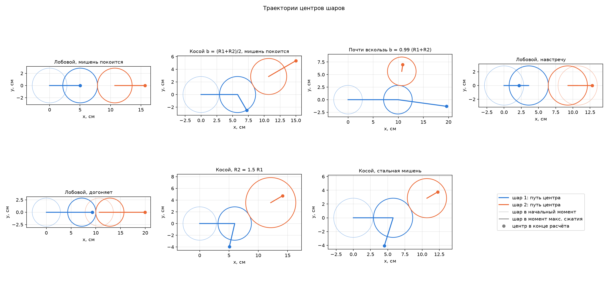
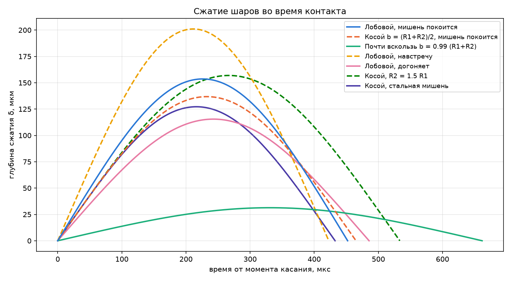
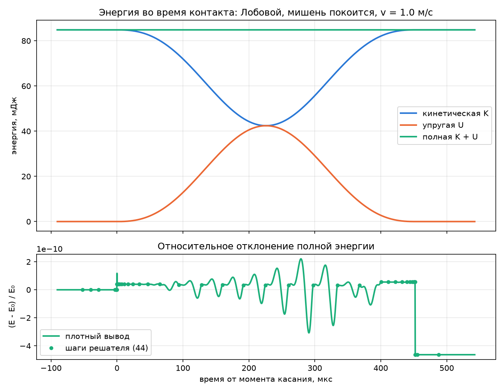
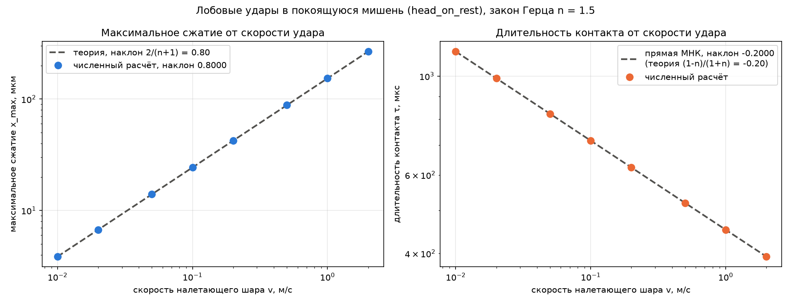
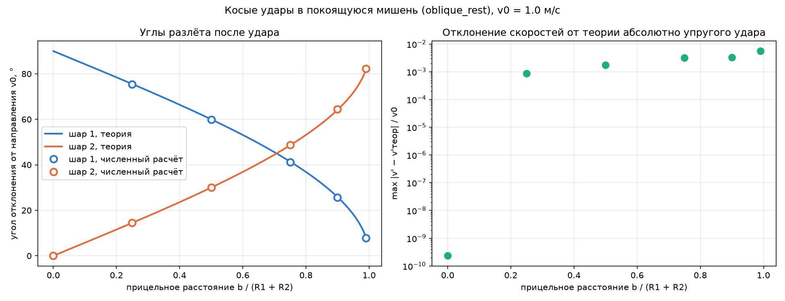

# M2. Столкновение бильярдных шаров на гладком столе

## 1. Постановка задачи

Моделируется столкновение двух гладких упругих шаров на плоскости. Во время
контакта шары деформируются, сила взаимодействия задаётся законом Герца.

**Допущения модели**

- Стол идеально гладкий. Вращение шаров не учитывается.
- Внешних сил нет. Вне контакта шары движутся равномерно и прямолинейно.
- Задача плоская: положения и скорости — двумерные векторы.
- Удар абсолютно упругий, внутреннего трения в материале нет.

**Границы применимости.** Рабочий набор: два одинаковых бакелитовых шара,
$R = 28.5$ мм, $E = 4.0$ ГПа, $\nu = 0.35$, $\rho = 1.75\cdot10^3$ кг/м³,
масса шара $m = 0.170$ кг.

- Закон Герца выведен для малой деформации: радиус пятна контакта
  $a = \sqrt{R^{\ast}\delta}$ должен быть много меньше радиуса шара. При $v = 1$ м/с
  $a/R \approx 0.05$, при $v = 2$ м/с $a/R \approx 0.07$.
- Модель считает удар абсолютно упругим.

Все расчёты ниже выполнены при скоростях до 2 м/с. При этих скоростях
деформация мала: $a/R < 0.1$.

## 2. Основные теоретические положения

### 2.1. Сила контакта

Глубина взаимного сжатия шаров с центрами $\vec r_1$, $\vec r_2$:

$$
\delta = R_1 + R_2 - |\vec r_2 - \vec r_1|.
$$

При $\delta > 0$ шары отталкиваются вдоль линии центров с силой Герца

$$
F = k \delta^{n}, \qquad n = \tfrac{3}{2}, \tag{1}
$$

при $\delta \le 0$ сила равна нулю.

Жёсткость пары определяется материалами
и радиусами:

$$
k = \frac{4}{3} E^{\ast} \sqrt{R^{\ast}}, \qquad
\frac{1}{E^{\ast}} = \frac{1-\nu_1^2}{E_1} + \frac{1-\nu_2^2}{E_2}, \qquad
\frac{1}{R^{\ast}} = \frac{1}{R_1} + \frac{1}{R_2}. \tag{2}
$$

### 2.2. Уравнения движения

С единичным вектором $\vec e = (\vec r_2 - \vec r_1)/\lvert\vec r_2 - \vec r_1\rvert$:

$$
m_1 \ddot{\vec r}_1 = -F \vec e, \qquad m_2 \ddot{\vec r}_2 = F \vec e. \tag{3}
$$

Силы равны и противоположны, поэтому полный импульс сохраняется точно.
Сила потенциальна, энергия упругой деформации

$$
U = \frac{k \delta^{n+1}}{n+1},
$$

и полная энергия $K + U$ сохраняется во время контакта.

### 2.3. Максимальное сжатие и длительность контакта

В лобовом ударе с относительной скоростью $u$ вся кинетическая энергия
относительного движения $\mu u^2/2$, $\mu = m_1 m_2/(m_1+m_2)$, в момент
максимального сжатия переходит в упругую:

$$
x_{max} = \left(\frac{(n+1) \mu u^2}{2k}\right)^{1/(n+1)} \tag{4}
$$

Длительность контакта по порядку величины равна $x_{max}/u$:

$$
\tau \propto \frac{x_{max}}{u} \propto u^{(1-n)/(1+n)} = u^{-0.2}. \tag{5}
$$

Чем быстрее шары, тем короче удар: сила Герца растёт быстрее линейной, и при
большом сжатии «пружина» становится жёстче.

### 2.4. Предел абсолютно твёрдых шаров

После удара сила исчезает, и конечные скорости должны совпадать с решением
для абсолютно упругого удара твёрдых шаров из законов сохранения импульса и
энергии. Лобовой удар:

$$
v_1' = \frac{(m_1-m_2)v_1 + 2m_2 v_2}{m_1+m_2}, \qquad
v_2' = \frac{(m_2-m_1)v_2 + 2m_1 v_1}{m_1+m_2}. \tag{6}
$$

Косой удар о покоящуюся мишень: шар 1 летит вдоль оси $x$ со скоростью $v_0$,
прицельное расстояние $b$ — смещение мишени поперёк направления полёта. Угол
между скоростью и линией центров в момент касания $\sin\alpha = b/(R_1+R_2)$.
Гладкие шары обмениваются только импульсом вдоль линии центров, касательные
составляющие скоростей не меняются. Отсюда

$$
\vec v_1' = v_0\left(A\cos\alpha + \sin^2\alpha,\ \ A\sin\alpha - \sin\alpha\cos\alpha\right), \qquad
\vec v_2' = v_0\left(B\cos\alpha,\ \ B\sin\alpha\right), \tag{7}
$$

$$
A = \frac{(m_1-m_2)\cos\alpha}{m_1+m_2}, \qquad B = \frac{2m_1\cos\alpha}{m_1+m_2}.
$$

При равных массах $A = 0$, и шары разлетаются под прямым углом.

## 3. Метод расчёта

Система (3) — восемь уравнений первого порядка для $(\vec r_1, \vec v_1,
\vec r_2, \vec v_2)$. Решается `scipy.integrate.solve_ivp`.

- Точность: относительная `rtol = 1e-10`, абсолютная `atol = 1e-12`.
- Максимальный шаг ограничен временем $2x_{max}/u$ из (4), чтобы решатель
  не перешагнул контакт целиком, пока шары летят свободно.
- Окно расчёта от 0 до $2t_{touch}$, где $t_{touch}$ — время до касания при
  равномерном движении. Начальный зазор между шарами много больше пути за
  время контакта, поэтому шары успевают разойтись.

Сила (1) при $\delta = 0$ негладкая. Если шаг решателя захватывает момент
касания, метод высокого порядка теряет точность на этом шаге. Худший случай
в расчётах — относительная ошибка $x_{max}$ около $3\cdot10^{-6}$, обычно
не больше $10^{-8}$.

| Модуль | Что делает |
|---|---|
| `config.py`, `scenarios/*.py` | параметры шаров, закон силы, точность решателя — все входные данные |
| `state.py` | класс `Ball`: положение, скорость, радиус, материал; масса из плотности |
| `model.py` | формулы (2), (4), сила (1), правая часть (3), вызов решателя |
| `analysis.py` | окно расчёта, моменты контакта, сжатие, энергия, импульс |
| `run.ipynb` | прогоны сценариев, серии расчётов, графики |
| `tests/test_model.py` | сравнение с аналитическими частными случаями |

## 4. Результаты при различных начальных данных

Семь сценариев, во всех шар 1 бакелитовый, $v_1 = 1$ м/с вдоль $x$.

| Сценарий | $m_2$, кг | $\vec v_2$, м/с | $\sin\alpha$ | $\vec v_1'$, м/с | $\vec v_2'$, м/с | $\tau$, мкс | $x_{max}$, мкм |
|---|---|---|---|---|---|---|---|
| лобовой, мишень покоится | 0.170 | (0, 0) | 0 | (0.000, 0.000) | (1.000, 0.000) | 452.1 | 153.6 |
| лобовой, навстречу | 0.170 | (−0.4, 0) | 0 | (−0.400, 0.000) | (1.000, 0.000) | 422.6 | 201.0 |
| лобовой, догоняет | 0.170 | (0.3, 0) | 0 | (0.300, 0.000) | (1.000, 0.000) | 485.5 | 115.5 |
| косой, $b = (R_1+R_2)/2$ | 0.170 | (0, 0) | 0.50 | (0.252, −0.434) | (0.748, 0.434) | 465.1 | 136.8 |
| почти вскользь | 0.170 | (0, 0) | 0.99 | (0.982, −0.134) | (0.018, 0.134) | 661.8 | 31.4 |
| косой, $R_2 = 1.5R_1$ | 0.573 | (0, 0) | 0.50 | (−0.155, −0.670) | (0.342, 0.198) | 533.4 | 156.9 |
| косой, стальная мишень | 0.756 | (0, 0) | 0.50 | (−0.222, −0.709) | (0.274, 0.159) | 432.5 | 127.2 |

Траектории центров шаров показаны на рис. 1, сжатие во время контакта — на
рис. 2.

*Рис. 1. Траектории центров шаров для семи сценариев. Блеклые окружности —
шары в начальный момент, яркие — в момент максимального сжатия.*

*Рис. 2. Глубина сжатия $\delta$ от времени с момента касания.*

Изменение полного импульса за удар во всех сценариях не превышает
$4\cdot10^{-16}$ от начального — это ошибка округления чисел с плавающей
точкой. Относительное изменение кинетической энергии до и после удара —
не больше $2\cdot10^{-8}$. Во время контакта кинетическая энергия переходит
в упругую и обратно, полная энергия сохраняется с точностью $5\cdot10^{-10}$
(рис. 3).

*Рис. 3. Кинетическая, упругая и полная энергия во время лобового удара,
$v = 1$ м/с. Внизу — относительное отклонение полной энергии от начальной.*

## 5. Сравнение с теоретическими решениями

### 5.1. Лобовой удар: конечные скорости

Для трёх лобовых сценариев конечные скорости сравнивались с (6). Максимальное
отклонение от теории, отнесённое к относительной скорости:

| Сценарий | теория $v_1'$, $v_2'$, м/с | отклонение |
|---|---|---|
| мишень покоится | 0, 1 | $2\cdot10^{-10}$ |
| навстречу | −0.4, 1 | $5\cdot10^{-9}$ |
| догоняет | 0.3, 1 | $3\cdot10^{-9}$ |

Равные шары при лобовом ударе обмениваются скоростями.

### 5.2. Максимальное сжатие и длительность контакта от скорости

Серия лобовых ударов о покоящуюся мишень при восьми скоростях от 0.01 до 2 м/с.
$x_{max}$ сравнивается с формулой (4), наклоны зависимостей в логарифмических
осях — с показателями из (4) и (5).

| $v$, м/с | $x_{max}$, мкм |
|---|---|
| 0.01 | 3.858 |
| 0.02 | 6.717 |
| 0.05 | 13.98 |
| 0.1 | 24.34 |
| 0.2 | 42.38 |
| 0.5 | 88.21 |
| 1 | 153.6 |
| 2 | 267.4 |

*Рис. 4. Максимальное сжатие и длительность контакта от скорости удара,
логарифмические оси.*

Расчёт совпадает с теорией до шестого знака. Выпадает точка $v = 0.2$ м/с
($3\cdot10^{-6}$): здесь шаг решателя пришёлся на момент касания.

### 5.3. Косой удар: углы разлёта от прицельного расстояния

Косой удар равных шаров о покоящуюся мишень, $v_0 = 1$ м/с, шесть значений
$b$. Конечные скорости сравниваются с (7).

| $b/(R_1+R_2)$ | $\vec v_1'$ расчёт, м/с | $\vec v_1'$ теория, м/с | $\vec v_2'$ расчёт, м/с | $\vec v_2'$ теория, м/с | $\max\lvert\Delta v\rvert/v_0$ |
|---|---|---|---|---|---|
| 0 | (0.00000, 0.00000) | (0.00000, 0.00000) | (1.00000, 0.00000) | (1.00000, 0.00000) | $2\cdot10^{-10}$ |
| 0.25 | (0.06299, −0.24294) | (0.06250, −0.24206) | (0.93701, 0.24294) | (0.93750, 0.24206) | $9\cdot10^{-4}$ |
| 0.5 | (0.25177, −0.43403) | (0.25000, −0.43301) | (0.74823, 0.43403) | (0.75000, 0.43301) | $1.8\cdot10^{-3}$ |
| 0.75 | (0.56571, −0.49566) | (0.56250, −0.49608) | (0.43429, 0.49566) | (0.43750, 0.49608) | $3.2\cdot10^{-3}$ |
| 0.9 | (0.81329, −0.38968) | (0.81000, −0.39230) | (0.18671, 0.38968) | (0.19000, 0.39230) | $3.3\cdot10^{-3}$ |
| 0.99 | (0.98167, −0.13413) | (0.98010, −0.13966) | (0.01833, 0.13413) | (0.01990, 0.13966) | $5.5\cdot10^{-3}$ |

Для шаров разной массы (сценарии $R_2 = 1.5R_1$ и стальная мишень,
$\sin\alpha = 0.5$) отклонение от (7) $2.5\cdot10^{-3}$ и $2.7\cdot10^{-3}$.

*Рис. 5. Слева — углы отклонения шаров от направления $\vec v_0$: линии —
теория (7), точки — расчёт. Справа — отклонение конечных скоростей от теории.*

В расчёте скорости равных шаров после удара перпендикулярны при всех $b$
($\vec v_1'\cdot\vec v_2' = 0$ с точностью решателя): это следует из законов
сохранения импульса и энергии и не зависит от модели удара. Отличаются от (7)
только углы. Отклонение от (7) при $b > 0$ на семь порядков больше
точности решателя и растёт с $b$, значит, это не численная ошибка, а разница
между моделями. Формула (7) считает шары твёрдыми: импульс передаётся
мгновенно вдоль линии центров в момент касания, расстояние между центрами
равно $R_1+R_2$. В модели Герца сила направлена по текущей линии центров,
и её направление отличается от момента касания.

При лобовом ударе ($b = 0$) совпадение с теорией точное.

### 5.4. Тесты

`tests/test_model.py` проверяет законы сохранения импульса и энергии,
формулы (6) и (7) при разных отношениях масс и скоростей, отсутствие удара
при расходящихся шарах, формулу жёсткости (2) и её предел для твёрдой стенки,
показатель $-0.2$ в (5).

## 6. Выводы

1. Модель деформируемых шаров с силой Герца воспроизводит законы сохранения:
   импульс сохраняется до ошибки округления ($10^{-16}$), полная энергия во
   время контакта — с точностью $5\cdot10^{-10}$, заданной точностью решателя.
2. Максимальное сжатие и длительность контакта подчиняются закону Герца:
   $x_{max} \propto v^{0.8}$, $\tau \propto v^{-0.2}$, расчётные показатели
   совпадают с теорией до шестого знака. При $v = 1$ м/с бакелитовые шары
   сжимаются на 0.15 мм, удар длится 0.45 мс.
3. В косом ударе равные шары разлетаются под прямым углом. Углы разлёта
   отличаются от модели твёрдых шаров на величину до $5\cdot10^{-3}$ от
   $v_0$, растущую с прицельным расстоянием.
4. Модель применима, пока деформация мала и материал остаётся упругим.
